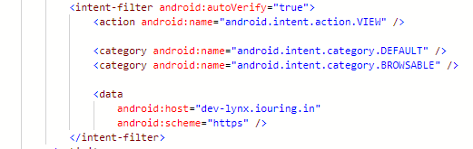
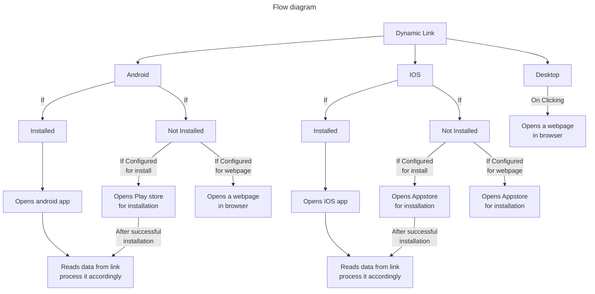

# Table of Contents

- [Middleware](#id-1)
  - [Configuration](#id-1-1)
  - [Services](#id-1-2)
  - [Database](#id-1-3)
  - [Dynamic Link](#id-1-4)
- [Android](#id-2)
- [IOS](#id-3)
- [Web](#id-4)
- [How it works?](#id-5)

## <center id="id-1" style="font-family:Helvetica ;color:red">Middleware</center>

Here Middleware refers to REST API services which are all used for dynamic linking feature, we used Golang to build API's.

## <span id="id-1-1" style="font-family:Helvetica ;color:lightblue">Configuration</span>

- **Config.yaml**: this file has all the required configuration for the services as well as mobile devices, including database configurations, log file configurations default configuration Open graph(OG meta tags) also android and ios package details.

## <span style="font-family:Helvetica ;color:lightblue">How to run?</span>

- `go run src/*.go -config <config-path>` is the command to run your go services.
- `go build src/*.go -o <output-path>` to generate executable file, `./<executable-file> -config <config-path>` to run the executable file with config.

## <span id="id-1-2" style="font-family:Helvetica ;color:lightblue">Services</span>

- **/.well-known/apple-app-site-association**: this API will be using by APN's server to validate the domain and the package name, as apple server validates randomly we have to make sure that this service should be always up, below is the sample response format which we have to return in response as json.
Refer more from [here][ios-app-verify]

```json
{
  "applinks": {
    "apps": [],
    "details": [
      {
        "appID": "5NG4LBGVER.com.nxtrad.cubeplus",
        "paths": [
          "NOT /_/*",
          "/*"
        ]
      }
    ]
  }
}
```

- **/.well-known/assetlinks.json**: As we do for IOS mobile, same setup is there for android as well, but URI path is different and response format also different,
android mostly validates when we are installing the app itself.
Refer more from [here][android-app-verify].

```json
[
  {
    "relation": [
      "delegate_permission/common.handle_all_urls"
    ],
    "target": {
      "namespace": "android_app",
      "package_name": "com.nxtrad.cubeplus",
      "sha256_cert_fingerprints": [
        "06:67:30:70:4A:40:50:00:CE:43:50:07:55:FB:D1:A1:2A:EC:C5:E4:14:CC:C1:4E:E5:19:F3:8B:58:D5:F0:A7"
      ]
    }
  }
]
```

- **/create**: this API is used to create short link, below json is the expected format of request data will be considered in this API.Its upto developers to handle authentication or authorization for this service, it is recommended to use some auth for this API to avoid that anyone can create the short link.

```json
{
  "android": {
    "fbl": "string" // custom fallback link if the short link opened from the android devices, leave this as empty so that configured behaviour will be handled in android
  },
  "data": any, //any type of data accepted in this field, the same we can get from resolver API's
  "expiry": "string", //2024-01-22 13:08:11 is the expected format
  "ios": {
    "fbl": "string" // custom fallback link if the short link opened from the IOS devices,leave this as empty so that configured behaviour will be handled in ios
  },
  "social": {
    "description": "string",
    "imgUrl": "string",
    "shortIcon": "string",
    "title": "string"
  }, // Open graph fields to show custom fields when we are sharing in social media platforms
  "webUrl": "string" // web url which has to resolved when users clicking on the short link
}
```

- **/{shortcode}**: this API handles navigation based on the different devices, for example if we want bring user to playstore if user doesn't installed the app on their mobile, we just have to configure proper playstore url and update `app-config->android->behavior` as `appsearch` if you want to navigate to any custom webpage update `app-config->android->behavior` as `custom` and change url in `android->android-default-web-url`, similar configuration applies for IOS also, update configurations in
`app-config->ios->behavior` and `app-config->ios-default-web-url`.
- **/data/{shortcode}**: If we want to get the actual data while we used in create API this API can be used, below is the sample data for this API, input field has the actual input for **/create** API.

```json
{
  "s": "ok",
  "d": {
    "input": {
      "type": "ekyc-referral"
    },
    "shortcode": "ebsWWY"
  }
}
```

## <span id="id-1-3" style="font-family:Helvetica ;color:lightblue">Database</span>

We use MySQL as the database to store and retrieve data for the short links.

## <center id="id-2" style="font-family:Helvetica ;color:red">Android</center>

## <center id="id-3" style="font-family:Helvetica ;color:red">IOS</center>

## <center id="id-4" style="font-family:Helvetica ;color:red">Web</center>

If we are opening the short link in a web browser from any desktop or laptop link will be redirected to the location url which we gave in `webUrl` field when we created the short link, along with the `shortcode` as query param additionally if we are passing json as the input in `data` field when we create short link those json params also will be appended as query params to the web url location when redirecting.

## <center id="id-5" style="font-family:Helvetica ;color:red">How it works?</center>

First and mandatory step to implement dynamic link feature is that our deep link scheme should starts with `http` or `https`, reason is that if someone who doesn't installed the target application android or ios will launch that short link into a default browser only from there our service can take over the control.

Example,

Short link: <https://dev-lynx.iouring.com/PnRj8>

1) If we click above link on android when we have installed the app already with proper configuration for the same url, it will launch the app directly without making any http request to our service.
2) If we don't installed that app already, android will launch default browser with the same short link.
3) In that case our service will be called and with `user-agent` header from the request we will identify which device requested for the link, based on that and configuration for the devices API will send the response.
4) Same implementation for IOS as well, but this feature which is called as universal links supports only from IOS version 9 or greater, for android greater than or equal to android 6.



[android-app-verify]:https://developer.android.com/training/app-links/verify-android-applinks
[ios-app-verify]:https://developer.apple.com/documentation/xcode/supporting-associated-domains